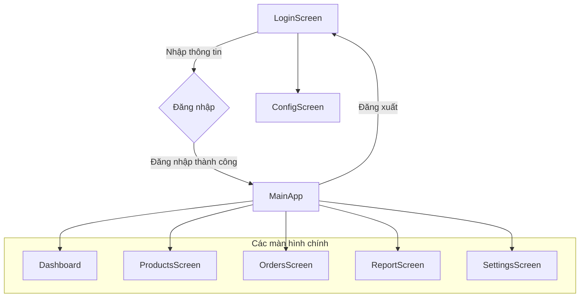
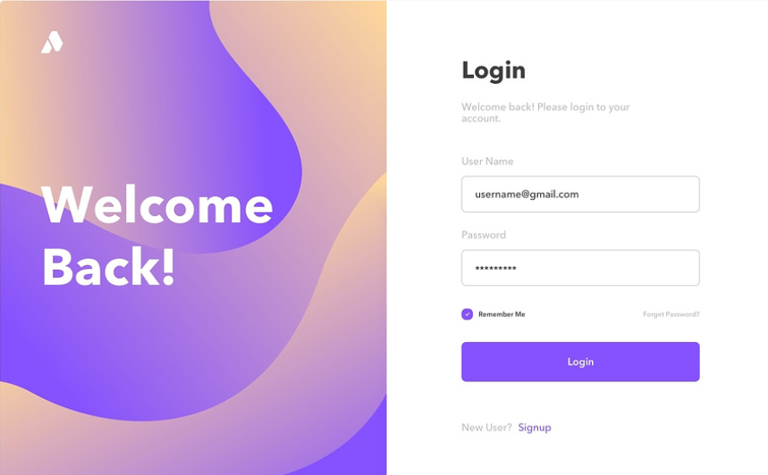
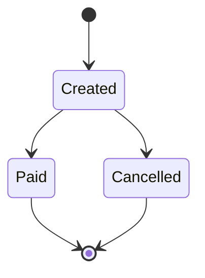

# Project MyShop 2024

# A. Yêu cầu chung

## A1. Tóm tắt yêu cầu

> Tạo ra ứng dụng hỗ trợ chủ cửa hàng bán hàng.
> 

## A2. Người dùng của hệ thống

- Hệ thống chỉ có một người dùng duy nhất là người chủ cửa hàng nhỏ.

## A3. Kiến trúc chương trình

Chương trình có kiến trúc client - server, sử dụng database tùy chọn. 

## A4. Luồng màn hình chính



- LoginScreen: Màn hình đăng nhập
    - ConfigScreen: Cấu hình địa chỉ server để kết nối
- Dashboard: Cho biết tổng quan về hệ thống
- ProductsScreen: Màn hình quản lí loại sản phẩm và sản phẩm
- OrdersScreen: Màn hình quản lí các đơn hàng
- ReportScreen: Màn hình báo cáo tình hình kinh doanh của hệ thống
- SettingsScreen: Màn hình cấu hình cho hoạt động của chương trình
    
    ## A5. Lược đồ CSDL
    
    ### Lược đồ CSDL gợi ý tổng quan
    
    ```mermaid
    erDiagram
        ORDER ||--|{ ORDER-ITEM : includes
        CATEGORY ||--|{ PRODUCT : "belongs to"
        PRODUCT ||--o{ ORDER-ITEM : "ordered in"
    ```
    
    ### Lược đồ CSDL gợi ý chi tiết
    
    ```mermaid
    erDiagram
        ORDER ||--|{ ORDER-ITEM : includes
        CATEGORY ||--|{ PRODUCT : "belongs to"
        PRODUCT ||--o{ ORDER-ITEM : "ordered in"
    
        ORDER {
            int order_id
            DateTime created_Time
            int final_price
        }
    
        ORDER-ITEM {
            int order_item_id
            int quantity
            float unit_sale_price
            int total_price
        }
    
        PRODUCT {
            int product_id
            string sku
            string name
            int import_price
            int count
            string description
        }
    
        CATEGORY {
            int category_id
            string name
            string description
        }
    ```
    
    ### Một số lưu ý
    
    - Thiết kế CSDL chỉ là gợi ý, học viên có thể tùy biến nếu thấy thích hợp. Nên trao đổi với giáo viên trước để được duyệt.
    - Giá sản phẩm không nhất thiết phải dùng tới kiểu dữ liệu tiền tệ chuyên biệt. Do đặc thù ở Việt Nam nên chỉ cần dùng số nguyên integer là quá đủ (4 tỉ).

# B. Các chức năng cơ sở (5 điểm)

## B1. Đăng nhập (0.25 điểm)

- [ ]  **Nếu có thông tin đăng nhập lưu từ lần trước thì tự động đăng nhập và đi vào màn hình chính luôn.**
- [ ]  **Thông tin đăng nhập cần phải được mã hóa.**
- [ ]  **Màn hình đăng nhập cần hiển thị thông tin phiên bản của chương trình**
- [ ]  Cho phép cấu hình thông tin server từ màn hình Config

Một màn hình đăng nhập có thể có cấu trúc tương tự như thế này



Phần bên trái có thể thay bằng Logo và tên của ứng dụng. 

## B2. Dashboard tổng quan hệ thống (0.5 điểm)

<aside>
💡 Mục tiêu của dashboard là nhằm cung cấp cái nhìn tổng quan của hệ thống

</aside>

Các thông tin cơ bản có thể bao gồm

- **Tổng số sản phẩm**
- **Cho biết top 5 sản phẩm sắp hết hàng (số lượng < 5)**
- **Cho biết top 5 sản phẩm bán chạy**
- **Tổng số đơn hàng trong ngày**
- **Tổng doanh thu trong ngày**
- **Chi tiết 3 đơn hàng gần nhất**
- **Biểu đồ doanh thu theo ngày trong tháng hiện tại**

Ví dụ một dashboard sẽ có hình dạng tương tự thế này

## B3. Quản lí sản phẩm - Products (1.25 điểm)

- Cho phép xem danh sách sản phẩm theo loại (theo themforest)
> Xem chi tiết > Xóa / Sửa
    - **Có hỗ trợ phân trang**
    - **Cho phép sắp xếp theo 1 loại tiêu chí**
    - **Cho phép lọc lại theo khoảng giá**
    - **Cho phép tìm kiếm dựa theo từ khóa trong tên sản phẩm**
- **Thêm mới loại sản phẩm & Thêm mới sản phẩm**
- Cho phép import dữ liệu từ tập tin Excel hoặc Access

### Yêu cầu tối thiểu về dữ liệu mẫu

- **Loại sản phẩm: có ít nhất 3 loại**
- **Sản phẩm**
    - **Mỗi loại sản phẩm có tối thiểu 22 sản phẩm**
    - Mỗi sản phẩm có tối thiểu 3 hình
    - **Dữ liệu mẫu không cần phải là thật nhưng nên giống thật.**

## B4. Quản lí đơn hàng - Orders (1.5 điểm)

- [ ]  **Tạo ra các đơn hàng**
- [ ]  **Cho phép xóa một đơn hàng, cập nhật một đơn hàng**
- [ ]  **Cho phép xem danh sách các đơn hàng có phân trang, xem chi tiết một đơn hàng**
- [ ]  Tìm kiếm các đơn hàng từ ngày đến ngày

**Trạng thái của đơn hàng: Mới tạo, Đã thanh toán, Đã hủy.**



## B5. Báo cáo thống kê - Report (1 điểm)

<aside>
💡 Mục tiêu chính của báo cáo là giúp người chủ 
1. Biết được tình trạng hệ thống hiện tại về sản phẩm & đơn hàng
2. Tình hình kinh doanh đang theo chiều hướng gì

</aside>

- **Xem các sản phẩm và số lượng bán theo ngày đến ngày, theo tuần, theo tháng, theo năm (vẽ biểu đồ đường)**
- **Báo cáo doanh thu và lợi nhuận theo ngày đến ngày, theo tuần, theo tháng, theo năm (vẽ biểu đồ cột / bánh)**

## B6. Cấu hình chương trình (0.25 điểm)

- **Hiệu chỉnh số lượng sản phẩm mỗi trang khi phân trang**
    - Ví dụ: 5/10/15/20
- **Lưu lại chức năng chính lần cuối mở.**
    - **Ví dụ lần cuối đang ở màn hình Products thì thay vì mỗi lần đăng nhập mặc định vào màn hình Dashboard đầu tiên thì ta sẽ vào thẳng màn hình lần trước đang làm việc là màn hình Products.**

## B7. Đóng gói thành file cài đặt (0.25 điểm)

- **Cần đóng gói thành file exe để tự cài chương trình vào hệ thống**

# C. Các chức năng tự chọn (5 điểm)

- [x]  Auto save khi tạo đơn hàng, thêm mới sản phẩm (0.25)
- [ ]  **Tự động thay đổi sắp xếp hợp lí các thành phần theo độ rộng màn hình (responsive layout) (0.5 điểm)**
- [x]  Chương trình có khả năng mở rộng động theo kiến trúc plugin (1 điểm)
- [ ]  **Bổ sung khuyến mãi giảm giá (1 điểm)**
- [ ]  **Làm rối mã nguồn (obfuscator) chống dịch ngược (0.25 điểm)**
- [x]  Thêm chế độ dùng thử - cho phép xài full phần mềm trong 15 ngày. Hết 15 ngày bắt đăng kí (mã code hay cách kích hoạt nào đó) (0.5 điểm)
- [ ]  **Backup / restore database (0.25 điểm)  ⇒ lệnh, tạo nút trong setting và xuất nguyên cái DB thành 1 file**
- [x]  Sử dụng GraphQL API thay cho REST (1 điểm)
- [ ]  **Sử dụng kiến trúc MVVM (0.5 điểm)**
- [ ]  **Sử dụng Dependency Injection (0.5 điểm)**
- [x]  Phân quyền admin và moderator / sale để truy cập dữ liệu hạn chế khác nhau. (Ví dụ sale chỉ thấy được giá bán còn admin thấy được cả giá nhập hoặc sale A chỉ thấy được các đơn hàng do mình bán trong ngày mà không thấy được các đơn hàng của sale B) (0.5 điểm)
    - [x]  Trả thêm hoa hồng bán hàng cho sale dựa trên doanh số (KPI) (0.25 điểm)
- [ ]  **Quản lí khách hàng (0.5 điểm)**
- [ ]  **Tạo ra các test  case kiểm thử chức năng và giao diện (0.5 điểm)**
- [ ]  **In đơn hàng (0.5 điểm). (Thay vì in ra máy in thì khi test chọn in ra file pdf/xps là được.)**
- [ ]  **Hỗ trợ sắp xếp khi xem danh sách theo nhiều tiêu chí, tùy biến chiều tăng / giảm (0.5 điểm)**
- [ ]  **Hỗ trợ tìm kiếm nâng cao  (1 điểm)**
- [x]  Hỗ trợ onboarding (0.5 điểm) ⇒ Hướng dẫn sử dụng phần mềm lần đầu sử dụng (Mỗi lần phải tạo tài khoản admin)
- [ ]  **Tổng: 6đ**
- [ ]  **Xem xét cộng điểm:** Backup key, activity log ⇒ đề nghị 1 đ

# D. Hướng dẫn nộp bài